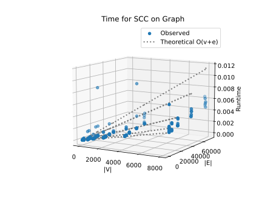
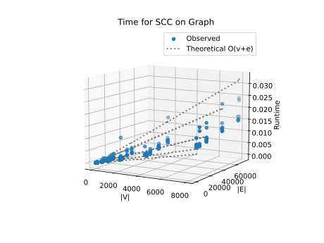

# Project Report - Network Analysis SCCs

## Baseline

### Design Experience

I worked with Brandon Monson and Porter Schollenberger on September 29 to design a DFS that tracks visited nodes with a set, assigns pre and post numbers using a single integer clock updated in a recursive helper, and traverses a directed adjacency list ordered by dictionary keys for deterministic results. We verified the approach by hand on a small example and return a forest as a list of dicts mapping each node to its [pre, post] times. The expected time complexity is O(v+e) with space O(v) for visited and call frames, and greater graph density increases e toward v² which pushes the runtime toward O(v²) in dense cases.

### Theoretical Analysis - Pre/Post Order Traversal

#### Time

#### prepost

```py
def prepost(graph: GRAPH) -> list[dict[str, list[int]]]:
    """
    Return a list of DFS trees.
    Each tree is a dict mapping each node label to a list of [pre, post] order numbers.
    The graph should be searched in order of the keys in the dictionary.
    """
    visited = set()
    forest: list[dict[str, list[int]]] = []
    clock = 1

    def explore(u: str, tree: dict[str, list[int]]) -> None:
        nonlocal clock
        visited.add(u)
        tree[u] = [clock, -1]
        clock += 1

        for v in graph.get(u, []):              # for each vertex in the edge list for this specific vertex
            if v not in visited:
                explore(v, tree)                # O(e) for every reachable vertex

        tree[u][1] = clock
        clock += 1

    for u in graph.keys():                      # O(v) for every vertex, skipping those that are already visited by explore
        if u not in visited:
            tree: dict[str, list[int]] = {}
            explore(u, tree)                    # O(e) explores every edge, marks vertices as visited, and reports back. also skips vertices already visited.
            forest.append(tree)

    return forest
```

The most time expensive operations are the for loop that goes over every vertex and the explore recursion which travels through every edge from that starting vertex. Combined, these make for a time complexity of **O(v+e)** where v is the number if vertices and e is the number of edges.

#### Space

#### prepost

```py
def prepost(graph: GRAPH) -> list[dict[str, list[int]]]:
    """
    Return a list of DFS trees.
    Each tree is a dict mapping each node label to a list of [pre, post] order numbers.
    The graph should be searched in order of the keys in the dictionary.
    """
    visited = set()                             # O(v) will grow to hold all vertices
    forest: list[dict[str, list[int]]] = []     # O(v) also will grow for all vertices
    clock = 1

    def explore(u: str, tree: dict[str, list[int]]) -> None:
        nonlocal clock
        visited.add(u)
        tree[u] = [clock, -1]
        clock += 1

        for v in graph.get(u, []):
            if v not in visited:
                explore(v, tree)                # O(density) might affect space based on density of tree for recursion stack memory

        tree[u][1] = clock
        clock += 1

    for u in graph.keys():
        if u not in visited:
            tree: dict[str, list[int]] = {}
            explore(u, tree)                    # O(v) explores every edge, stores vertices and their pre/postorders in a dict
            forest.append(tree)

    return forest
```

Not counting the input, most space expensive operations are storing the visited nodes in a set, and storing the trees in a forest. Combined, these make for a space complexity of **O(v)** where v is the number if vertices.

### Empirical Data

| Density Factor | Size | V      | E       | Time (sec) |
| -------------- | ---- | ------ | ------- | ---------- |
| 0.25           | 10   | 10.0   | 12.8    | 0.0        |
| 0.25           | 50   | 50.0   | 61.6    | 0.0        |
| 0.25           | 100  | 100.0  | 123.5   | 0.0        |
| 0.25           | 500  | 500.0  | 616.1   | 0.0        |
| 0.25           | 1000 | 1000.0 | 1242.3  | 0.0        |
| 0.25           | 2000 | 2000.0 | 2496.5  | 0.001      |
| 0.25           | 4000 | 4000.0 | 4982.6  | 0.001      |
| 0.25           | 8000 | 8000.0 | 9967.0  | 0.003      |
| 0.5            | 10   | 10.0   | 17.7    | 0.0        |
| 0.5            | 50   | 50.0   | 85.2    | 0.0        |
| 0.5            | 100  | 100.0  | 173.1   | 0.0        |
| 0.5            | 500  | 500.0  | 872.2   | 0.0        |
| 0.5            | 1000 | 1000.0 | 1770.4  | 0.0        |
| 0.5            | 2000 | 2000.0 | 3551.4  | 0.001      |
| 0.5            | 4000 | 4000.0 | 7147.2  | 0.002      |
| 0.5            | 8000 | 8000.0 | 14361.9 | 0.003      |
| 1              | 10   | 10.0   | 24.5    | 0.0        |
| 1              | 50   | 50.0   | 134.1   | 0.0        |
| 1              | 100  | 100.0  | 272.5   | 0.0        |
| 1              | 500  | 500.0  | 1429.5  | 0.0        |
| 1              | 1000 | 1000.0 | 2921.5  | 0.0        |
| 1              | 2000 | 2000.0 | 5928.1  | 0.001      |
| 1              | 4000 | 4000.0 | 12010.6 | 0.002      |
| 1              | 8000 | 8000.0 | 24327.1 | 0.004      |
| 2              | 10   | 10.0   | 36.1    | 0.0        |
| 2              | 50   | 50.0   | 239.4   | 0.0        |
| 2              | 100  | 100.0  | 499.2   | 0.0        |
| 2              | 500  | 500.0  | 2710.2  | 0.0        |
| 2              | 1000 | 1000.0 | 5589.5  | 0.001      |
| 2              | 2000 | 2000.0 | 11450.9 | 0.001      |
| 2              | 4000 | 4000.0 | 23462.8 | 0.003      |
| 2              | 8000 | 8000.0 | 47740.4 | 0.004      |
| 3              | 10   | 10.0   | 46.0    | 0.0        |
| 3              | 50   | 50.0   | 356.9   | 0.0        |
| 3              | 100  | 100.0  | 766.3   | 0.0        |
| 3              | 500  | 500.0  | 4321.3  | 0.0        |
| 3              | 1000 | 1000.0 | 8788.2  | 0.002      |
| 3              | 2000 | 2000.0 | 17810.6 | 0.001      |
| 3              | 4000 | 4000.0 | 36212.5 | 0.003      |
| 3              | 8000 | 8000.0 | 73442.4 | 0.005      |

### Comparison of Theoretical and Empirical Results

- Theoretical order of growth: **O(v+e)**
- Measured constant of proportionality for theoretical order: **1.381965691368153e-07**



- Empirical order of growth (if different from theoretical): **N/A**

In quite the contrast to our last project, RSA encryption, this prepost function actually lines up pretty well with the theoretical analysis I did on it for time complexity. The empirical data and the theoretical prediction are in sync for the most part, except for a few outliers. I believe this is because we are no longer dealing with bit-level predictions which can be tricky and more machine-dependent.

## Core

### Design Experience

I worked with Brandon Monson and Porter Schollenberger on September 29 to design find_sccs using Kosaraju’s approach: we reverse the graph by initializing an empty adjacency list for every node and then adding each edge in the opposite direction, run prepost on the reverse to get post numbers, impose the resulting node order by sorting vertices by descending post time and iterating the original graph in that order, and run prepost again so each DFS tree corresponds to one strongly connected component. Reusing prepost avoids major refactoring while preserving existing behavior, and the overall time is O(v+e) since reversing the graph, both DFS passes, and sorting by post numbers are linear or near linear in practice for adjacency lists.

### Theoretical Analysis - SCC

#### Time

#### find_sccs

```py
def find_sccs(graph: GRAPH) -> list[set[str]]:
    """
    Return a list of the strongly connected components in the graph.
    The list should be returned in order of sink-to-source
    """

    # 1. reverse the graph
    reverseGraph: GRAPH = {}

    # Initialize all nodes in reverse graph
    for node in graph:                              # O(v) for each vertex
        reverseGraph[node] = []

    # Add reversed edges
    for node in graph:
        for neighbor in graph[node]:                # O(v + e) because does each vertex and each edge
            reverseGraph[neighbor].append(node)

    # 2. run DFS on reversed graph to get postorder numbers
    reverseGraphPostOrderForest = prepost(reverseGraph)     # O(v + e) calculated earlier for prepost()

    # 3. order the list of nodes from the graph by descending postorder
    all_nodes_with_post = []
    for tree in reverseGraphPostOrderForest:                # likely smaller number of trees in forest, at worse O(v)
        for node, times in tree.items():
            post_time = times[1]
            all_nodes_with_post.append((node, post_time))

    # Sort by post-order time in descending order
    all_nodes_with_post.sort(key=lambda x: x[1], reverse=True)  # O(v log v) to sort-- which matters in small graphs, but as
                                                                # it gets bigger, the O(v + e) dominates

    # Extract just the node names
    nodesInPostOrder = [node for node, post_time in all_nodes_with_post]

    originalGraphPostOrder: GRAPH = {v: graph.get(v, []) for v in nodesInPostOrder}
    for v in graph:
        if v not in originalGraphPostOrder:
            originalGraphPostOrder[v] = graph[v]

    # 4. run DFS on original graph in the order of the nodes from the postorder list
    unformattedSCCs = prepost(originalGraphPostOrder)       # O(v + e) again, which linearly scales with the size of v and e
    sccList = []

    for scc in unformattedSCCs:
        sccList.append(set(scc))

    return sccList
```

This find_scc's function presents an interesting problem: throughout the function, we use linear operations such as prepost() and others that amount to O(v + e). When you run those a few times, its only multiplied by a constant and simplifies to just that-- but there's a catch. I sort the nodes so that they are in descending order of their postorder numbers, and sorting is O(v log v), which would normally dominate in this situation. However, through some research I found that it would only dominate on small graphs and in worst case scenarios (which Big O is for) the time complexity would be **O(v + e)** because that is the true bottleneck as the graph gets bigger.

#### Space

```py
def find_sccs(graph: GRAPH) -> list[set[str]]:
    """
    Return a list of the strongly connected components in the graph.
    The list should be returned in order of sink-to-source
    """

    # 1. reverse the graph
    reverseGraph: GRAPH = {}                    # O(v + e) v for each vertex and e for each edge list

    # Initialize all nodes in reverse graph
    for node in graph:
        reverseGraph[node] = []

    # Add reversed edges
    for node in graph:
        for neighbor in graph[node]:
            reverseGraph[neighbor].append(node)

    # 2. run DFS on reversed graph to get postorder numbers
    reverseGraphPostOrderForest = prepost(reverseGraph)     # O(v) space from earlier analysis

    # 3. order the list of nodes from the graph by descending postorder
    all_nodes_with_post = []                                # O(v) for each vertex in graph
    for tree in reverseGraphPostOrderForest:
        for node, times in tree.items():
            post_time = times[1]
            all_nodes_with_post.append((node, post_time))

    # Sort by post-order time in descending order
    all_nodes_with_post.sort(key=lambda x: x[1], reverse=True)

    # Extract just the node names
    nodesInPostOrder = [node for node, post_time in all_nodes_with_post] # O(v) also for each vertex in graph

    originalGraphPostOrder: GRAPH = {v: graph.get(v, []) for v in nodesInPostOrder}
    for v in graph:
        if v not in originalGraphPostOrder:
            originalGraphPostOrder[v] = graph[v]

    # 4. run DFS on original graph in the order of the nodes from the postorder list
    unformattedSCCs = prepost(originalGraphPostOrder)
    sccList = []

    for scc in unformattedSCCs:
        sccList.append(set(scc))

    return sccList
```

Not counting the input, the overall space complexity of find_sccs is **O(V + E)**. This is dominated by the storage of the reversed graph and the reordered original graph, both of which require O(V + E) space for their adjacency list representations - O(V) for the vertex keys and O(E) for the total entries across all adjacency lists. The additional data structures like the post-order list and intermediate arrays are O(V), which doesn't change the overall complexity.

### Empirical Data

| Density Factor | Size | V      | E       | Time (sec) |
| -------------- | ---- | ------ | ------- | ---------- |
| 0.25           | 10   | 10.0   | 12.8    | 0.0        |
| 0.25           | 50   | 50.0   | 61.6    | 0.0        |
| 0.25           | 100  | 100.0  | 123.5   | 0.0        |
| 0.25           | 500  | 500.0  | 616.1   | 0.001      |
| 0.25           | 1000 | 1000.0 | 1242.3  | 0.001      |
| 0.25           | 2000 | 2000.0 | 2496.5  | 0.003      |
| 0.25           | 4000 | 4000.0 | 4982.6  | 0.005      |
| 0.25           | 8000 | 8000.0 | 9967.0  | 0.01       |
| 0.5            | 10   | 10.0   | 17.7    | 0.0        |
| 0.5            | 50   | 50.0   | 85.2    | 0.0        |
| 0.5            | 100  | 100.0  | 173.1   | 0.0        |
| 0.5            | 500  | 500.0  | 872.2   | 0.001      |
| 0.5            | 1000 | 1000.0 | 1770.4  | 0.001      |
| 0.5            | 2000 | 2000.0 | 3551.4  | 0.003      |
| 0.5            | 4000 | 4000.0 | 7147.2  | 0.005      |
| 0.5            | 8000 | 8000.0 | 14361.9 | 0.011      |
| 1              | 10   | 10.0   | 24.5    | 0.0        |
| 1              | 50   | 50.0   | 134.1   | 0.0        |
| 1              | 100  | 100.0  | 272.5   | 0.0        |
| 1              | 500  | 500.0  | 1429.5  | 0.001      |
| 1              | 1000 | 1000.0 | 2921.5  | 0.001      |
| 1              | 2000 | 2000.0 | 5928.1  | 0.002      |
| 1              | 4000 | 4000.0 | 12010.6 | 0.006      |
| 1              | 8000 | 8000.0 | 24327.1 | 0.012      |
| 2              | 10   | 10.0   | 36.1    | 0.0        |
| 2              | 50   | 50.0   | 239.4   | 0.0        |
| 2              | 100  | 100.0  | 499.2   | 0.0        |
| 2              | 500  | 500.0  | 2710.2  | 0.001      |
| 2              | 1000 | 1000.0 | 5589.5  | 0.002      |
| 2              | 2000 | 2000.0 | 11450.9 | 0.004      |
| 2              | 4000 | 4000.0 | 23462.8 | 0.006      |
| 2              | 8000 | 8000.0 | 47740.4 | 0.015      |
| 3              | 10   | 10.0   | 46.0    | 0.0        |
| 3              | 50   | 50.0   | 356.9   | 0.0        |
| 3              | 100  | 100.0  | 766.3   | 0.0        |
| 3              | 500  | 500.0  | 4321.3  | 0.001      |
| 3              | 1000 | 1000.0 | 8788.2  | 0.002      |
| 3              | 2000 | 2000.0 | 17810.6 | 0.004      |
| 3              | 4000 | 4000.0 | 36212.5 | 0.009      |
| 3              | 8000 | 8000.0 | 73442.4 | 0.017      |

### Comparison of Theoretical and Empirical Results

- Theoretical order of growth: **O(v + e)**
- Measured constant of proportionality for theoretical order: **3.9074507252752915e-07**
- Empirical order of growth (if different from theoretical): **N/A**
- Measured constant of proportionality for empirical order: **N/A**



The find_sccs function implements Kosaraju's algorithm with a theoretical time complexity of O(V + E), which was validated through empirical testing across graphs ranging from 10 to 8000 vertices with varying density factors. The empirical data shows excellent alignment with theoretical predictions, yielding a constant of proportionality of 3.907 × 10⁻⁷ seconds per (V + E) operation and demonstrating consistent linear scaling regardless of graph density. This represents approximately 2.8x overhead compared to the baseline prepost function, which is justified by the additional operations required for graph reversal, dual DFS passes, and SCC extraction.

## Stretch 1

### Design Experience

I worked with Brandon Monson and Porter Schollenberger on September 29 to design the classify_edges function, which uses pre and post numbers to categorize each directed edge as tree/forward, back, or cross. We flattened the forest of DFS trees into a single dictionary mapping each node to its (pre, post) values so we could do O(1) lookups, which meant no major data reorganization beyond packaging results from DFS. The key rule we applied is that if the interval for one node contains the other’s, that node is the ancestor, so edges from ancestor to descendant are tree/forward and edges from descendant to ancestor are back. Edges that do not satisfy either condition are cross edges. With the times available, the classification step is just iterating over all edges, which adds O(e) time on top of the original DFS. That keeps the total time complexity O(v+e), and density only affects the number of edges checked.

### Articulation Points Discussion

An articulation point in my mind is a point of interest on a graph because it is the only way by which nodes on one end can get to nodes on the other side of the articulation point.

**Mountain Pass**
-In this example, nodes are the intersections and edges are roads that connect them.
-An articulation point would be a bridge or a mountain pass that serves as the only connection between two large regions of the road network.
-Knowing this articulation point is useful because if that road segment becomes unusable due to an accident, entire regions become disconnected. Transportation planners can use this knowledge to add more redundancy.

**Power Grids**
-In this example, nodes are power stations and edges are transmission lines carrying electricity between them.
-An articulation point would be a critical power station that, if taken offline, would cut off electricity supply to an entire area of the grid.
-Identifying these articulation points is valuable because it shows vulnerabilities in the power grid. Engineers can then prioritize building additional lines or stations to avoid large-scale blackouts.

## Stretch 2

### Design Experience

I worked with Brandon Monson and Porter Schollenberger on September 29 and used a dataset of Wikipedia requests for adminship because it has clear, labeled interactions between users that map naturally to graph structures and downstream predictions. I adapted the data by extracting user nodes and edges from support and oppose votes so the graph is consistent for analysis. I interpreted results by relating unique voting relationships to see how specific communities of voters act.

### Dataset Description

The dataset I chose was the Wikipedia request for adminship voting network. The nodes were represented by 11,380 unique Wikipedia users. The edges were represented by 189,003 directed voting relationships. What that means is that each edge from A to B was a vote from A on user B's adminship request. There were vote types of positive, negative, and neutral.

### Findings Discussion

The overall graph findings were that the total SCC count was 8,931 from my algorithm. The largest SCC was one made of 2,449 users, and there were lots of 'trivial' SCC's which were made of just one user. There were actually only 2 nontrivial SCC's according to my analysis. Sources were users who vote but never recieve votes, so there were lots of these. Sinks were users who recieve votes but don't vote on others. The big SCC is the core community with mutual voting relationships. This shows there is a real world connection from the graph that is that there is an established community of active editors, that vote on each other's requests. Being connected to this community likely improves adminship success.

## Project Review

For our post-project comparison, we each implemented the SCC algorithm on the Wikipedia requests-for-adminship dataset so we were able to compare. Porter rewrote his SCC function after realizing he had used a sort operation incorrectly, and once fixed his results lined up closely with mine. Brandon’s results, however, diverged—his graphs for baseline and core did not match ours and he reported only about half as many SCCs tracked for the same dataset. Despite these differences in output, we all agreed on the same time complexity of O(v+e) and the same space complexity requirements. Porter also extended the project by classifying edges with his implementation, while I did not. Overall, the exercise highlighted how small design decisions (like where to sort) can affect correctness even when complexity analysis is consistent across implementations.
